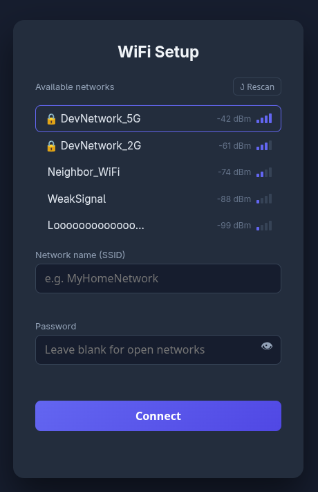

<div align="center">

# esp-wifi-provisioning
#### Rust implementation of a WiFi provisioning captive portal for ESP32


</div>

## Project Description

WiFi provisioning via a captive-portal soft-AP for ESP32 targets, built on [`esp-idf-svc`](https://github.com/esp-rs/esp-idf-svc). When a device has no stored credentials, it broadcasts a setup access point and serves a small web UI. Users connect to the AP, are redirected to the portal automatically, pick their network, and enter a password. The device saves the credentials to NVS and connects. No hardcoded SSIDs, no serial flashing required.

## Table of Contents

<!-- mtoc-start -->

* [Screenshot](#screenshot)
* [Repository layout](#repository-layout)
* [Getting started](#getting-started)
  * [Prerequisites](#prerequisites)
  * [Setup Script](#setup-script)
  * [User Permissions for Serial](#user-permissions-for-serial)
  * [Build and flash the example](#build-and-flash-the-example)
* [Using the library in your own project](#using-the-library-in-your-own-project)
* [Development](#development)
* [License](#license)

<!-- mtoc-end -->

## Screenshot

The captive portal web UI:



## Repository layout

```
esp-wifi-provisioning/
├── esp-wifi-provisioning/   # the library crate (published to crates.io)
├── example/                 # a complete ESP32 binary that uses the crate
├── setup.sh                 # installs toolchain dependencies
└── Cargo.toml               # workspace root
```

## Getting started

### Prerequisites

To get started with this project, make sure to install the following dependencies on your system.

Arch based (via Pacman):
```bash
sudo pacman -S git cmake ninja python python-pip python-virtualenv dfu-util libusb ccache gcc pkg-config clang llvm libxml2 libxml2-legacy dotenv
```

Debian based (via apt):
```bash
sudo apt-get install git wget flex bison gperf python3 python3-pip python3-venv cmake ninja-build ccache libffi-dev libssl-dev dfu-util libusb-1.0-0 dotenv
```

### Setup Script

After having installed the dependencies and having cloned the repository, run the setup script at the root of the repository:
```bash
chmod +x ./setup.sh
./setup.sh
```

Restart your shell (or source your profile) after the script completes so the toolchain is on your `PATH`.

### User Permissions for Serial

On Arch-based distros, the `uucp` group controls access to `/dev/ttyUSB*` devices (equivalent to `dialout` on Debian-based distros). Add your user to the appropriate group:

Arch-based:

```bash
sudo usermod -aG uucp $USER
newgrp uucp
```

Debian-based:

```bash
sudo usermod -aG dialout $USER
newgrp dialout
```

### Build and flash the example

Connect your ESP32, then:

```bash
cd example
cargo run --release
```

`cargo run` will build, flash, and open a serial monitor. On first boot the device will broadcast a `ESP32-Setup` access point. Connect to it from any phone or laptop, the captive portal should appear automatically.

## Using the library in your own project

Add it to your workspace or crate:

```toml
[dependencies]
esp-wifi-provisioning = "0.1"
```

Minimal integration:

```rust
use esp_wifi_provisioning::Provisioner;

let wifi = Provisioner::new(wifi, nvs)
    .ap_ssid("MyDevice-Setup")
    .provision()
    .expect("provisioning failed");
```

See the [`example/`](example/) directory for a complete working binary, and the [crate documentation](https://docs.rs/esp-wifi-provisioning) for the full API reference.

## Development

All crates in this repository share a workspace. To run a full build:

```bash
cargo build --workspace
```

The portal web UI lives in `esp-wifi-provisioning/src/web/`. HTML, CSS, and JS are combined and minified at build time by `build.rs`, no separate frontend build step is needed.

To iterate on the portal UI without flashing hardware, open `esp-wifi-provisioning/src/web/index.html` directly in a browser. The `DEV_NETWORKS` block in `app.js` provides mock network data so the UI is fully functional offline. That block is automatically stripped from the production build.

## License

This software is licensed under the [MIT license](LICENSE)
